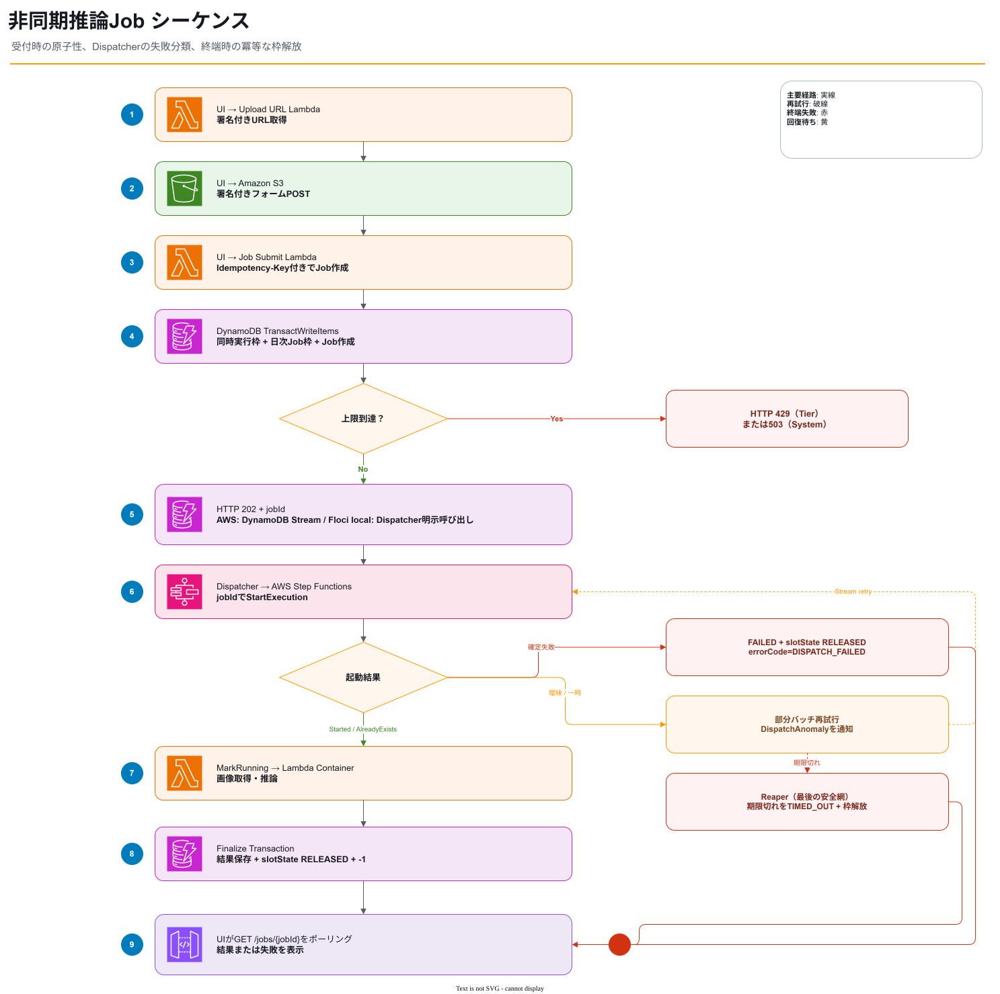
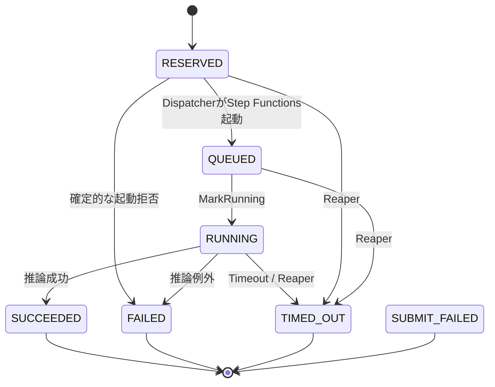

# 非同期ワークフロー設計



編集元: [`sequence-job.drawio`](diagrams/source/sequence-job.drawio)

## 1. 状態遷移



## 2. Step Functions Standard

ワークフロー:

```text
MarkRunning
  ↓
RunInference (Lambda Container)
  ├─ Success → FinalizeSuccess → Succeed
  ├─ Sandbox.Timedout / Lambda.Unknown / States.Timeout → FinalizeTimeout → Fail
  └─ States.ALL → FinalizeFailure → Fail
```

Standard Workflowを選ぶ理由:

- 非同期Job単位の実行履歴
- 長時間ワークフロー
- Retry / Catch / Timeout
- 将来のECS `RunTask.sync`差し替え
- Expressより状態追跡と運用確認を優先

## 3. Job受付とワークフロー起動の境界

Job Submit Lambdaは以下を同期処理として行う。

1. 入力所有権確認
2. 同時実行枠と日次Job枠の確保 + Job作成トランザクション
3. `RESERVED`のJob IDを202で返す

システム受付上限はCDKの容量契約でLambda実容量と結び付ける。
共有枠では受付上限に制御系Lambda用余白を加えた未予約同時実行数をデプロイ前に要求し、予約枠では推論LambdaのReserved Concurrencyを受付上限と同値で導出する。
この契約はデプロイ時点の容量不足を防ぐが、実行中の一時的なLambda throttlingを成功として扱うものではない。

同じトランザクションはユーザーとシステムの日次Jobカウンターも更新する。
既存JobのIdempotency-Key再送はトランザクション前または競合後の再読取で既存Jobを返すため、日次利用量を二重加算しない。

トランザクションの確定でJobsテーブルのDynamoDB Streamへ起動要求が永続化される。
Dispatcher Lambdaは`RESERVED`かつ`HELD`の新しいイメージだけを処理し、`StartExecution(name=jobId)`を呼んだ後にJobを`QUEUED`へ更新する。
同名実行がすでに存在する場合は成功した再送として扱う。

Workflowが作成されていないと確定する`StateMachineDoesNotExist`、`InvalidArn`、`InvalidExecutionInput`、`InvalidName`、`ValidationException`では、DispatcherがJobを`FAILED`、`errorCode=DISPATCH_FAILED`へ即時終端化する。
この終端化は`status=RESERVED`かつ`slotState=HELD`を条件に、Job更新とユーザー・システム同時実行枠の減算を一つのトランザクションで行う。
終端化した起動拒否は`DispatchAnomaly`へ`failureKind=terminalized`として記録する。
日次Jobカウンターは受付量と費用の上限なので返却しない。

通信タイムアウト、ネットワークエラー、5xx、`ExecutionLimitExceeded`などの一時エラーは、Workflowが開始している可能性または回復可能性があるため即時終端化しない。
`StartExecution`成功後の`QUEUED`更新失敗も、Workflowがすでに動作しているため即時終端化しない。
これらはEvent Source Mappingが部分バッチ単位で再試行し、`DispatchAnomaly`メトリクスと`failureKind=retryable`または`failureKind=finalize`の構造化ログで通知する。
再試行後も`RESERVED`または`QUEUED`のまま初期リースが切れたJobは、Reaperが最後の安全網として`TIMED_OUT`へ回収する。
運用者が利用者の検索を代理再実行しないため、SQS DLQは設けない。

Floci 1.5.33の`local` Contextだけは、CloudFormationへStreamを指定してもDynamoDB Streams APIにStreamが作成されない。
このためローカルStackではEvent Source Mappingを作らず、トランザクション確定後にJob Submit LambdaがDispatcher Lambdaを明示的に呼び出す。
このアダプターはDispatcherの同じ冪等処理を通り、`LOCAL_DISPATCHER_FUNCTION_NAME`と最小の`lambda:InvokeFunction`権限をローカルStackだけへ追加する。
AWS環境ではこの変数と権限を持たず、DynamoDB Streamsを信頼性境界として維持する。

## 4. MarkRunning

- Job所有者や入力は変更しない。
- `status` を `RUNNING` へ更新する。
- `startedAt` を設定する。
- `leaseExpiresAt` を推論タイムアウト + 余裕時間へ延長する。
- `slotState=HELD` でない場合は推論を開始しない。

## 5. RunInference

入力例:

```json
{
  "jobId": "abc",
  "userId": "cognito-sub",
  "objectKey": "uploads/cognito-sub/input.jpg"
}
```

出力例:

```json
{
  "modelVersion": "catalog-dinov2-small-abc123",
  "processingTimeMs": 5200,
  "predictions": [
    {
      "rank": 1,
      "productCode": "ABC-001",
      "productName": "Example product",
      "brand": "Example brand",
      "confidence": 0.82
    }
  ]
}
```

`productName`と`brand`は任意であり、既存stubは従来の3項目だけを返す。
`confidence`は校正済み確率ではなく、カタログ検索で使った0から1の類似度である。
`catalog`プロファイルは、最高類似度が索引のしきい値未満の場合に空の`predictions`を返す。
候補なしは推論処理自体の失敗ではないため、Jobは`SUCCEEDED`となる。
推論Lambdaはモデル呼出し前に入力をJPEGまたはPNGとして実デコードする。
最大辺4096、最大16,777,216画素を超える画像、壊れた画像、別形式の画像はモデルへ渡さない。

## 6. Finalize

成功、失敗、タイムアウトは同じ共通関数へ集約する。

- Jobを終端状態へ更新
- 結果またはエラー概要を保存
- `slotState=HELD` の場合だけ枠解放
- `activeKey` と `leaseExpiresAt` を削除
- 再実行時は既に解放済みとして成功扱い

## 7. Reaper

EventBridge Scheduled Ruleが5分ごとに起動する。
Reaperは既知のDispatcher起動拒否を処理する通常経路ではなく、再試行後も残った不明状態や予期しない停止を回収する最後の安全網である。

検索:

```text
ActiveJobsIndex
activeKey = ACTIVE
leaseExpiresAt < now
```

処理:

- 各Jobへ共通Finalizeを `TIMED_OUT` で実行
- GSIをページングし、1回の処理件数と並列数を制限する
- 残件が多い場合は次回へ継続
- 回収件数、失敗件数、残件有無をカスタムメトリクスと戻り値へ出す

## 8. Retry方針

| 処理 | Retry |
|---|---|
| MarkRunning | Lambdaサービス例外と`States.ALL`を最大4回 |
| Inference | Lambda throttlingとLambdaサービス一時エラーだけを最大3回 |
| Finalize | 指数バックオフで複数回 |
| StartExecution | 確定的な拒否は即時FAILED、それ以外はEvent Source Mapping Retry + SDK標準Retry + 同名実行 |

推論コードの例外、入力不正、タイムアウトは再試行しない。
`Lambda.TooManyRequestsException`、`Lambda.ServiceException`、`Lambda.AWSLambdaException`、`Lambda.SdkClientException`だけを2秒からの指数バックオフで再試行する。

## 9. キャンセル

初期実装ではキャンセルAPIを対象外とする。追加する場合:

- Job所有者を確認
- Step Functions `StopExecution`
- Fargate移行時はTask停止
- Finalizeを `CANCELLED` で実行
- StopExecutionイベントだけに枠解放を依存しない
