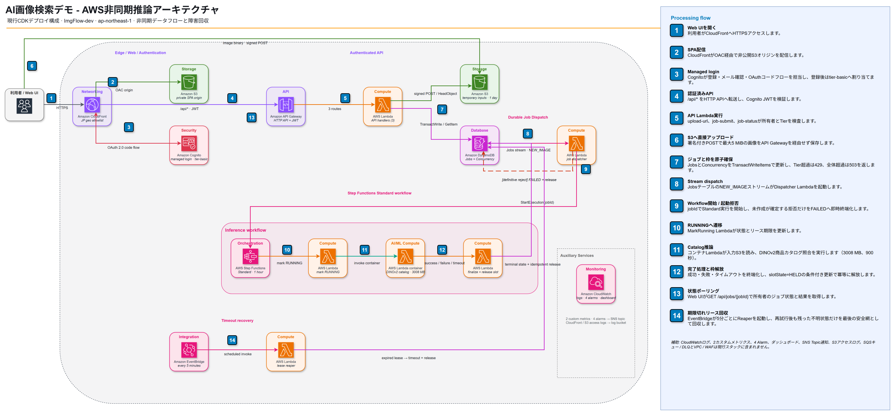

# ImgFlow 基本設計

## 1. 目的

ローカルで学習済みの画像推定モデルを、Web UIから非同期で利用できるAWSシステムとして提供する。ユーザーはAmazon Cognitoで管理し、所属Tierに応じて未完了推論ジョブの上限を制御する。

現時点ではモデル本体、推論時間、最大メモリ使用量が未確定であるため、まずLambdaコンテナを実行基盤として設計し、実モデル受領後に成立性を測定する。

汎用デモでは、任意の`catalog`プロファイルで商品画像から登録済み型番候補を検索できる。
このプロファイルはDINOv2-smallの画像埋め込みと静的な商品カタログ索引を使い、型番を生成しない。
通常のCIとFlociは外部成果物を必要としない`stub`を使い、利用者提供の本番モデル接続点は`real`として分離する。
AWS開発環境の標準デプロイは`catalog`を使い、実サービス上で商品画像検索を確認できる状態を維持する。

## 2. 基準アーキテクチャ



編集元: [`imgflow-architecture.drawio`](diagrams/source/imgflow-architecture.drawio)

### コンポーネント

- Amazon S3: Web UIの静的ファイル、入力画像、必要に応じた結果
- Amazon CloudFront: Web UI配信、`/api/*` のAPI Gateway転送、AWS環境の日本許可リスト
- Amazon Cognito User Pools: ユーザー、Tierグループ、AWS環境のマネージドログインとメール検証付き自己登録
- Amazon API Gateway HTTP API: JWT検証、非同期Job API
- AWS Lambda:
  - Upload URL発行
  - Job受付・枠確保
  - DynamoDB StreamsからのWorkflow起動
  - Job状態取得
  - Job状態遷移・枠解放
  - Reaper
  - 自己登録確認後のBasic付与
- AWS Step Functions Standard: 推論ワークフロー
- Lambdaコンテナ: モデル読込・推論・上位3候補生成
- Amazon DynamoDB:
  - Jobsテーブル
  - Concurrencyテーブル
- Amazon EventBridge Scheduled Rule: 期限切れJobの定期回収
- Amazon CloudWatch: ログ、メトリクス、アラーム

## 3. 基本フロー

1. AWS環境のWeb UIは、有効なセッションがなければCognitoマネージドログインへ自動遷移する。メールアドレスを必須入力として登録し、メールへ届いたコードで確認するとPost Confirmation Lambdaが`tier-basic`を付与する。Authorization Code GrantとPKCEのcallback処理中または認証エラー時は自動遷移を繰り返さず、再試行用ログイン画面を表示する。Flociローカル環境では直接認証を使う。
2. UIでファイル選択、ドラッグ&ドロップ、または対応端末のカメラ撮影からJPEG/PNGを入力し、署名付きURLを取得する。
3. ブラウザが署名付きPOSTフォームで画像をS3へ直接送信する。
4. UIがJob作成APIを呼ぶ。
5. Job Submit LambdaがJWTからユーザーIDとTierを判定する。
6. DynamoDBトランザクションでユーザー枠・システム枠・Jobを原子的に更新する。
7. Tier上限は429、システム上限は503を返す。
8. 成功時はJob IDと受付時点のstatusを202で返す。
9. JobsテーブルのStreamを受けたDispatcherが、Job IDを実行名としてStep Functionsを冪等に起動する。
10. Workflowが作成されていないと確定する起動拒否では、Dispatcherが`RESERVED`かつ`HELD`を条件にJobを`FAILED`へ終端化して枠を解放する。
11. 通信失敗、サービス一時エラー、Workflow開始後の更新失敗では枠を解放せず、Streamの再試行とReaperの最終回収へ委ねる。
12. Step Functionsが状態をRUNNINGへ変更し、Lambdaコンテナを呼ぶ。
13. 結果またはエラーをJobsテーブルへ保存する。
14. 条件付きトランザクションで枠を一度だけ解放する。
15. UIはJob状態をポーリングし、上位3候補を表示する。

### 3.1 Web UIの体験設計

ページタイトルは日本語では「AI画像検索デモ」、英語では「AI Image Search Demo」とする。
表示言語は画面上のセグメントコントロールで即時に切り替え、選択値をブラウザのlocalStorageへ保存する。
Cognitoへ遷移するときは保存済み言語を`lang=ja`または`lang=en`としてauthorize URLへ毎回指定し、マネージドログイン、自己登録、パスワード再設定の表示言語をWeb UIと一致させる。
画像の選択、アップロード、Job受付、検索中、成功、候補なし、失敗を同じ入力面と結果面の連続した状態として表示する。

視覚言語はApple風の意匠を品質目標とする。
明るい半透明マテリアル、システムフォントのサイズ別トラッキング、十分な余白、大きな角丸、細い境界、柔らかな影、青を主役にした抑制された配色で階層を作る。
押下への即時フィードバックと短い状態遷移を設けるが、`prefers-reduced-motion`では移動を止める。
`prefers-reduced-transparency`ではマテリアルを不透明にし、`prefers-contrast`では文字と境界のコントラストを強める。

端末カメラは`accept="image/jpeg,image/png"`と`capture="environment"`を持つファイル入力から標準撮影UIを開く。
ブラウザが`capture`を提供しない場合は通常の画像選択として動作し、いずれも既存のContent-Typeとファイルサイズ検証を通す。

Cognitoマネージドログアウトでは、保存済みセッションを消した後もReact上の認証済み画面を未認証画面へ切り替えない。
先に全画面のログアウト中表示へ移り、その描画後にCognitoの`/logout`へ遷移する。
CognitoからCloudFrontへ戻って自動ログインを再開するときも全画面の移動中表示を維持し、Cognitoのauthorize画面へ遷移するまで認証カードを描画しない。
認証カードはPKCE生成や遷移開始が失敗した場合の再試行画面としてだけ表示する。

手順9はAWS環境の経路である。
Floci 1.5.33ではDynamoDB Stream自体が作成されないため、`local` Contextだけ手順6の確定後にJob Submit LambdaがDispatcher Lambdaを明示呼び出しする。
Dispatcher以降の冪等処理は共通であり、AWS向けStackへローカル専用環境変数とInvoke権限は含めない。

## 4. 同時実行の意味

本設計の「同時実行」は、物理的にCPU上で実行中の処理数ではなく、受付済みで未完了のJob数とする。

枠消費状態:

- `RESERVED`
- `QUEUED`
- `RUNNING`

枠を消費しない終端状態:

- `SUCCEEDED`
- `FAILED`
- `TIMED_OUT`
- `CANCELLED`
- `SUBMIT_FAILED`

現在のAPIとWorkflowが生成する終端状態は`SUCCEEDED`、`FAILED`、`TIMED_OUT`である。
`CANCELLED`と`SUBMIT_FAILED`は互換性のため型に残した予約済み状態であり、現在の処理は生成しない。

Job受付時に枠を確保することで、上限到達時に同期HTTPレスポンスとして429を返せる。

受付済みJob数とLambda実行容量はCDKの容量契約で関連付ける。
共有枠ではシステム受付上限と制御系Lambda用余白の合計をAWSデプロイ前に実quotaへ照合する。
予約枠では推論LambdaのReserved Concurrencyをシステム受付上限から導出し、二つの値を独立指定できないようにする。

## 5. Tier初期値

| Tier | Cognitoグループ | ユーザー単位上限 |
|---|---|---:|
| Basic | `tier-basic` | 1 |
| Standard | `tier-standard` | 3 |
| Premium | `tier-premium` | 4 |

AWS devではシステム全体上限を4、制御系Lambda用余白を6とする。
システム全体上限はCDK Contextで環境ごとに変更できるが、制御系余白はアーキテクチャ定数とする。
Tier上限は単調増加かつシステム全体上限以下に制約し、対象リージョンのLambda quotaに対するデプロイ前検証を必須とする。
日次Job上限はBasic 10、Standard 30、Premium 100、システム全体100とする。
アップロードURL件数と予約バイト量は日次Job上限と最大画像サイズから導出し、独立した設定値にしない。
自己登録を確認したユーザーはBasicへ自動所属する。
登録画面とAPIはTierを受け取らず、StandardとPremiumへの変更は管理者がCognitoグループで行う。

## 6. 主要な整合性ルール

- ユーザー枠・システム枠・Job作成は1つのDynamoDBトランザクションで実行する。
- `slotState=HELD` のJobだけ枠を解放できる。
- 解放トランザクションで `slotState=RELEASED` とカウンター減算を同時実行する。
- 同じ完了イベントが再送されても、カウンターは1回だけ減る。
- `Idempotency-Key` をユーザーIDと組み合わせ、Job IDを決定論的に生成する。
- Jobは所有者本人だけが参照できる。
- 入力S3キーは `uploads/<cognito-sub>/...` に限定する。
- 同時実行枠、日次Job枠、Job作成を一つのDynamoDBトランザクションで確保する。
- 推論前にJPEGまたはPNGを実デコードし、形式、寸法、画素数を検証する。
- CloudFrontはGeo Restrictionに加えてCSP、HSTSなどのSecurity Headers Policyを適用する。

## 7. 非同期化の理由

- モデルの推論時間が不明。
- Lambdaのコールドスタートと3.6GB級モデルの初期化時間が不明。
- API Gatewayの同期タイムアウトに依存させない。
- UIで複数Jobを管理し、状態表示できる。
- 将来、推論TaskだけをECS Fargateへ差し替えられる。

## 8. SQSを処理キューにしない理由

Step Functions StandardがJob単位の状態、Retry、Catch、Timeout、履歴を管理できるため、初期構成ではSQSを通常処理のバッファにしない。
検索は利用者の意思で再実行する処理であり、運用者が失敗レコードから代理再実行するSQS DLQも設けない。
明確なWorkflow起動拒否はDispatcherが即時に`FAILED`へ終端化し、曖昧な失敗はDynamoDB Streamsの再試行後もJobを保持してReaperを最後の安全網とする。

SQSは以下が必要になった段階で追加する。

- 大量Jobの負荷平準化
- Tier間の優先度キュー
- 常駐ECS Worker
- 推論リソースの処理能力と受付枠を分離

## 9. Lambda不成立時の差し替え

維持するもの:

- UI
- Cognito
- Upload URL
- S3
- Job API
- DynamoDB同時実行管理
- Step Functions
- Job状態モデル

変更するもの:

```text
Step Functions → Lambda Container
```

から

```text
Step Functions → ECS RunTask.sync → Fargate Task
```

推論コアはLambdaハンドラーから分離し、再利用可能にする。

## 10. ローカル再現

通常の統合確認はAWS開発環境を基準とする。FlociはAWS資格情報を使わない高速な確認、オフライン作業、競合や回収処理の補助結合試験に使用する。

Flociで以下を再現する。

- S3
- Cognito
- API Gateway v2
- Lambda
- ECR / CDK DockerImageFunction
- DynamoDB
- Step Functions
- EventBridge Scheduled Rule
- CloudWatch Logs

CloudFrontの実配信、OAC、日本許可リスト、Cognito提供ドメインのマネージドログイン、自己登録確認後トリガー、実TLS、AWS Lambdaの性能・コールドスタートはAWS開発環境で確認する。

CloudFrontのGeo RestrictionはDistribution全体へ適用し、WebとCloudFront経由の`/api/*`を日本からだけ利用可能にする。
Cognito提供ドメイン、API Gatewayのexecute-api直URL、発行後のS3署名付きアップロードURLはDistributionを通らないため、この制限の対象外である。

## 11. 現時点の対象外

- 学習機能
- 実モデルの実装
- GPU推論
- ECS Fargate本実装
- WebSocketプッシュ通知
- 管理者UI
- 課金
- Tier変更UI
- 推論結果を学習データとして承認する機能
